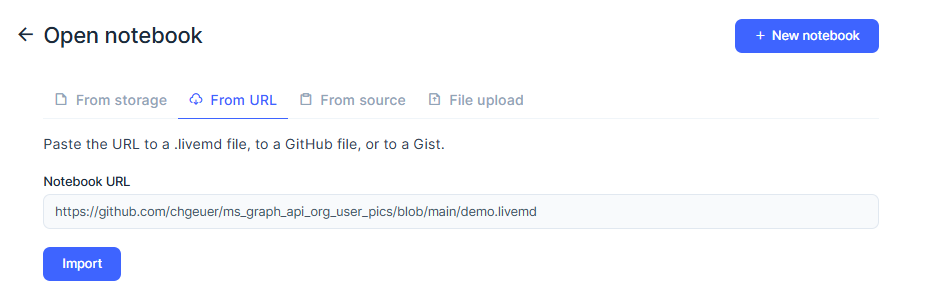
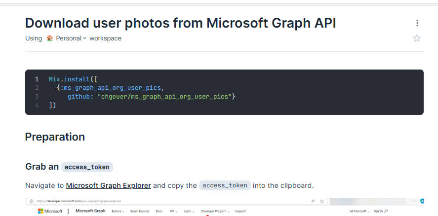

# MsGraphApiOrgUserPics

> This is an Elixir LiveBook-based demo on how to retrieve high-resolution user profile pictures for a team from Microsoft Graph API.

## Usage

This demo is supposed to be run using a local Livebook.

1. **Install Livebook** on your Windows machine
   1. By downloading the installer from https://livebook.dev/#install (Click the Windows logo)
   2. Running the `LivebookInstall-latest-windows-x86_64.exe` from your `Downloads` directory
2. **Start Livebook on Windows**. 
   1. Usually, an Edge web browser window should pop up (pointing to something like `http://localhost:52607/?token=.......`)
   2. If you don't see a web browser window, click on the system tray (lower right corner and look for the pink book), right-click and say 'Open'
3. In the Livebook app, click the "Open" button, and select "From URL", and paste `https://github.com/chgeuer/ms_graph_api_org_user_pics/blob/main/demo.livemd` into the "Notebook URL"

4. After opening the notebook from the URL, you should see this...

5. Navigate to [Microsoft Graph Explorer](https://developer.microsoft.com/en-us/graph/graph-explorer) and copy the `access_token` into the clipboard.

Click "Evaluate" on the cell below, and paste the access token into the text field.

Also enter the org manager's e-mail into the other text box.

> NEVER share your access token with any external party!!

Now you should be ready to go...
